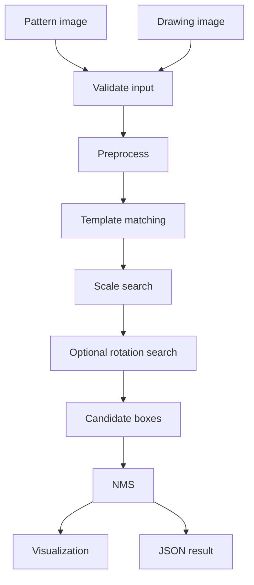
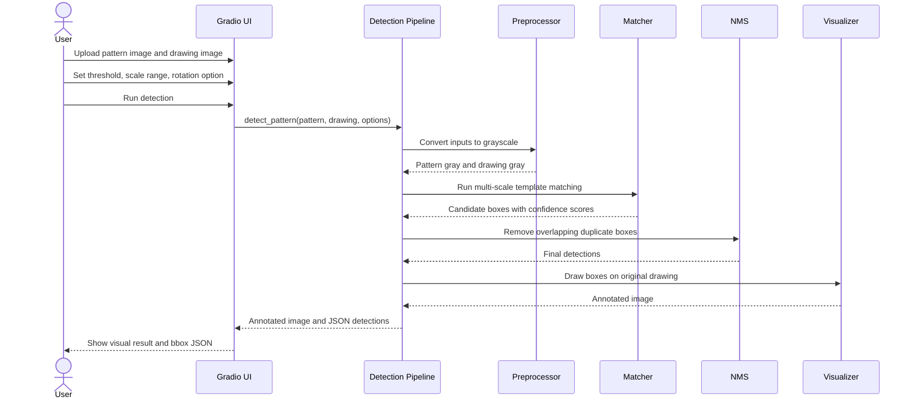
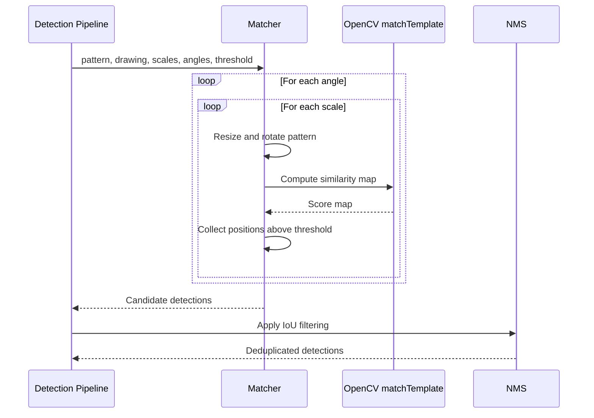

# System Design

# Zero-Shot Pattern Detection for Technical BOM Drawings

## Goal

Build a small CPU-friendly web demo that accepts a pattern image and a drawing image, then returns every matched region as bounding boxes with confidence scores.

## Why Template Matching

Template matching is the first implementation because:

- It is naturally zero-shot: the user-uploaded image is the template.
- It does not require labeled data.
- It works well for black-and-white line drawings where symbols are visually repeated.
- It runs on CPU.
- It produces similarity scores that map cleanly to confidence values.
- It is easy to explain in an assessment document.

Deep/foundation models are deferred because they add weight, slower CPU runtime, and uncertain behavior on arbitrary cropped schematic symbols.

## Pipeline

## Sequence Diagrams

### Main Inference Sequence

### Matching Sequence

## Modules

| File | Role |
| --- | --- |
| `src/preprocess.py` | Grayscale, binary, edge preprocessing and pattern crop-to-content |
| `src/matcher.py` | OpenCV template matching over scale/angle variants |
| `src/nms.py` | IoU-based duplicate box removal |
| `src/visualize.py` | Draw boxes and confidence scores |
| `src/pipeline.py` | End-to-end inference orchestration |
| `app.py` | Gradio web UI |

## Requirement Mapping

| Requirement | Implementation |
| --- | --- |
| Upload pattern + drawing | Gradio image inputs |
| Zero-shot behavior | Pattern image is used directly as template |
| Bounding boxes | `Detection.bbox = (x, y, w, h)` |
| Confidence score | OpenCV normalized correlation score |
| Multiple detections | All points above threshold are collected before NMS |
| Multi-scale | Default scale range `0.35..1.50`, step `0.05` |
| Rotation | Optional `[0, 90, 180, 270]` search |
| Visualization | Red boxes drawn on original drawing |
| JSON/text output | Gradio code panel returns formatted JSON |
| CPU-friendly demo | OpenCV + NumPy, no model weights |
| Miss debugging | JSON includes `best_match_before_threshold` |

## Error Handling

- Missing pattern -> `"Pattern image is required"`.
- Missing drawing -> `"Drawing image is required"`.
- Pattern larger than drawing -> clear error.
- Unsupported preprocessing mode -> clear error.
- No detection -> empty `detections` and original drawing visualization. `best_match_before_threshold` still shows the strongest attempted location.

## Future Work

- Add ORB/SIFT fallback for geometric variation.
- Add adaptive thresholding from score distribution.
- Add document deskewing.
- Add ROI selection.
- Add batch pattern matching.
- Add image pyramid optimization for large drawings.
